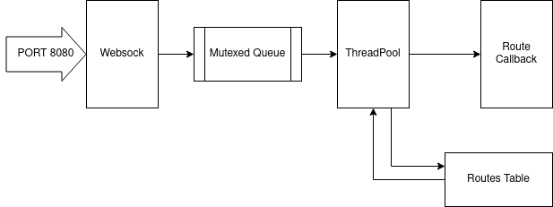

# Cerver

Cerver is C backend Server dedicated to handle REST requests. This server allows to set custom REST resource routes with custom handles.

# How to setup the server - Creating custom routes 

To add custom route, go to file named ```routes.c``` and declare new structure of Route type like ones visible belowe. Example routes shows how to send a file to html/js client.


```
// *********************************************** USER ROUTES *******************************************//

Route route_root = {.request=GET , .addr="/", .fnc_ptr=root_response};
Route route_js = {.request=GET , .addr="/script.js", .fnc_ptr=js_response};
Route route_css = {.request=GET , .addr="/style.css", .fnc_ptr=css_response};
Route route_png = {.request=GET ,.addr="/water.png", .fnc_ptr=png_response};
Route route_post_data = {.request=GET , .addr="/ReadDev", .fnc_ptr=get_data};
Route route_get_data = {.request=POST , .addr="/ReadDev", .fnc_ptr=post_data};
```

The Route structure consists of three fields: ```request``` holding REST reuqest command, ```addr``` holding path to resource and callback to custom handler. 

```
struct Route{
    uint8_t request;
    char *addr;
    void (*fnc_ptr)(uint8_t sockfd,uint8_t request, uint8_t* request_content,size_t length_data); 
}typedef Route;
```

Custom callback can be created based on the one below. The arguments it is receiving are obligatory the same as ```response``` function. 

```
void example(uint8_t sockfd,uint8_t request, uint8_t* request_content,size_t length_data){

    response(sockfd,"200 OK",content,content_size,"text/html"); 
};
```

Response function should be filled with ```request_code``` like "200 OK", ```content_ptr``` content pointer, ```content_size``` content size, ```type``` MIME type.

```
response(sockfd,request_code,content_ptr,content_size,type); 
```

Next custom route and handler should be added to ```routes.h```. Route need to be added as extern to be passed during initialization. 

```
// *********************************************** USER ROUTES *******************************************//

void root_response(uint8_t sockfd, uint8_t request, uint8_t* request_content,size_t length_data);
void js_response(uint8_t sockfd, uint8_t request, uint8_t* request_content,size_t length_data);
void css_response(uint8_t sockfd, uint8_t request, uint8_t* request_content,size_t length_data);
void png_response(uint8_t sockfd, uint8_t request, uint8_t* request_content,size_t length_data);
void get_data(uint8_t sockfd,uint8_t request,uint8_t* request_content,size_t length_data);
void post_data(uint8_t sockfd,uint8_t request,uint8_t* request_content,size_t length_data);
Queue* data_queue;

extern Route route_root;
extern Route route_js;
extern Route route_css;
extern Route route_png;
extern Route route_post_data;
extern Route route_get_data;

```

The last step is to pass route to routes table and init routes table. It can be done like below:  

```
#include "server.h"
#include "routing.h"
#include "routes.h"


int main(int argc, char **argv){
    
    init_routes();
    add_route(&route_root);
    add_route(&route_js);
    add_route(&route_css);  
    add_route(&route_png); 
    add_route(&route_post_data);
    add_route(&route_get_data);


    websock();      
```
Server is starting when the ```websock``` is invoked.

# Server



Server is listening on port 8080 for incoming traffic. It can handle multiple connections, and for robustness purposes multithreading capabilities were added. 

Every incomming connection is accepted in main thread in ```websock``` function in ```server.c```. 

```
int websock(){


    [...]
    
    for(int n =0; n <THREADS_POOL;n++){
        pthread_create(&thread_pool[n],NULL,_thread,NULL);
    }

    while(1){
        int conn_sock;
        conn_sock = accept(sockfd, &destaddr,&cli_addr_size);
        pthread_mutex_lock(&mutex);
        queue_push(&conn_sock,sizeof(int),&threads_tasks);
        pthread_cond_signal(&cond);
        pthread_mutex_unlock(&mutex);
   
    }
    
}
```

After accepting connection, socket id is pushed into mutexed queue and signal is send to inform (also in ```server.c```) threads in pool waiting for tasks. 

```
void * _thread(){
    [...]

    while(1){
        pthread_mutex_lock(&mutex);
        status_code=queue_pull(&socket,&size,&threads_tasks);
        if(QUEUE_EMPTY == status_code){
            pthread_cond_wait(&cond,&mutex);
            status_code=queue_pull(&socket,&size,&threads_tasks);
        }
        pthread_mutex_unlock(&mutex);
        
        if(QUEUE_EMPTY != status_code && NULL != socket){
            conn_hnld(socket);        
        }
    }

}
```

Every thread (in ```conn_hnld```) is reading connection from received socket, next received message is parsed to get route, request command, and other necessary informations.

```
void conn_hnld(int socket){
    uint8_t readline[BUFF_SIZE];

    read(socket , readline, BUFF_SIZE); 
    printf("\n\n REQUEST: \n\n %s \n\n END OF REQUEST for socket: %d \n\n",readline,socket);
    
    Request req = get_REST(socket,readline);
    
    call_route(&req);
    bzero(readline,BUFF_SIZE);
    close(socket);
}
```

Those information are passed to ```call_route``` in ```routing.c```. This allow to get information if route is in routes table (if not 404 is sent). If route is in routes table, the callback is invoked, and connection is closed and thread is returning to waiting mode. 

````
uint8_t call_route(Request* req){
    
    [...]
    
    uint8_t hash = key(request,req->addr);    
    if(0==strncmp(routes[hash]->addr,req->addr,strlen(req->addr))){ // if hash is occupied find new one
        if(routes[hash]->fnc_ptr != NULL)routes[hash]->fnc_ptr(sconn,request,request_content,length_data);
        call_bad_route = 0;
    }
    else{
        for(uint8_t i =0;i < MAX_ROUTES; i++){
            uint8_t try = (hash + i) % MAX_ROUTES;
            if(0==strncmp(routes[try]->addr,req->addr,strlen(req->addr))){
                if(routes[hash]->fnc_ptr != NULL)routes[hash]->fnc_ptr(sconn,request,request_content,length_data);
                call_bad_route = 0;
            }
        }
    }
    if(1 == call_bad_route)bad_route.fnc_ptr(sconn,request,request_content,length_data); // if hash doesnt lead to any route call bad route
    free(request_content);
    return 0;
} 
```
This process is only thing the server is doing.   
